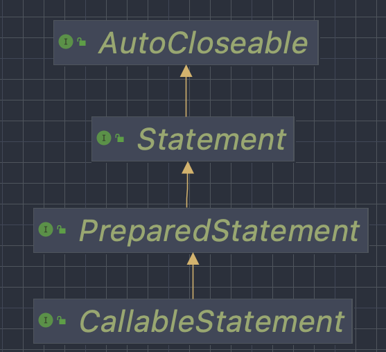

# Java 17 Oracle Certified Professional study notes

### How to print bytes as String
```java
byte b = 4;
String.format("%8s", Integer.toBinaryString(b & 0xFF)).replace(' ', '0'))
```
### Initialization order notes
A class or interface of type T will be initialized before the first occurrence of any of the following:
- instantiation of T
- invoking a static method of T
- T static field assignment
- static field (N.B. not a constant) declared in T is used
- when a class is initialized, so do their super classes and superinterfaces containing default methods
- a reference to a static (n.b. not a constant) field causes initialization of only the class or interface that declares it (ignoring their possible
superclasses)

Therefore, the below class does not initialize the Child class (i.e. executing its static initializer block) regardless 
of referencing a static parent field from it. 
```java
class Super {
    static String id = "Super"; // This member could also be a constant
}

class Child {   
  static {
      System.out.printf("Static initializer block...%n");
  }
}

public class Test {
    public static void main(String...args) {
      System.out.print(Super.id);  // It'll only print "Super"
    }
}
```

### New text block methods
- `public String indent(int numberSpaces)` → adds/removes the same number of blank spaces of each line. **It's with
noting that if absent, it'll add a new line (\n) to the end of the string.**
- `public String stripIndent()` → It removes all incidental whitespace, but **does not add 
a trailing line break if missing like the above method.**

Example:
```java
final var greeting = " hola\n"
        .concat("  hello\n")
        .concat(" bonjour.");

greeting.indent(-1)/**
                    *hola\n
                    * hello\n
                    *bonjour\n
                    */

greeting.indent(-2)/**
                    *hola\n
                    *hello\n
                    *bonjour\n
                    */

greeting.indent(0) /**
                    * hola\n
                    *  hello\n
note the \n added → * bonjour\n
                    */

greeting.stripIndent()/**
                       *hola\n
                       * hello\n
  \n not added !!! →   *bonjour
                       */
```

### String comparison
Strings in Java are naturally ordered (i.e. ascending from smaller to bigger) in the following order:
1. Numbers 
2. `CharSequences` in capital letters 
3. `CharSequences` in small letters 

e.g.
Given
```java
String[] array = {"abc", "T", "TOTO", "123", "1", "2", "_1_2", "xyz", "a", "x", "z", "y", "xy", "b", "c", "d", "ab", "ba", "ac", "ca"};
Arrays.sort(array); // It'll become: [1, 123, 2, T, TOTO, _1_2, a, ab, abc, ac, b, ba, c, ca, d, x, xy, xyz, y, z]
```

### Time API notes

- `ZonedDateTime` contains an `OffSetDateTime` as well as a Zone. However, both types can be initialized as:

```java
OffsetDateTime.now(ZoneId.of("America/La_Paz")) // 2022-06-06T14:12:06.294197-04:00
ZonedDateTime.now(ZoneId.of("America/La_Paz")) // 2022-06-06T14:12:06.294197-04:00[America/La_Paz]
```
One fundamental difference relies on the fact that `ZonedDateTime` allows daylight saving calculations:
```java
// Given the US's spring forward:
ZonedDateTime.of(LocalDateTime.parse("2022-03-13T01:30:00"), ZoneId.of("America/Los_Angeles"))
        .plusHours(1) // 2022-03-13T03:30-07:00[America/Los_Angeles]
        
// Whereas
OffsetDateTime.of(LocalDateTime.parse("2022-03-13T01:30:00"), ZoneOffset.of("-08:00"))
        .plusHours(1) //2022-03-13T02:30-08:00

// It's worth noting that CEST timezone is not accepted by ZoneId class, instead always use CET:
ZonedDateTime.of(LocalDateTime.parse("2022-03-27T01:30:00"), ZoneId.of("CET"))
        .plusHours(1) // 2022-03-27T03:30+02:00[CET]
```
- The most important patterns used by `SimpleDateFormat` and `DateTimeFormatter` are:

| Symbol                                       | Meaning                                                                              | Example                                                    |
|----------------------------------------------|--------------------------------------------------------------------------------------|------------------------------------------------------------|
| y<br/>yy<br/>yyyy<br/>yyyyy [*]              | year, it can also work with `Y`                                                      | 2022<br/>22<br/>2022<br/>02022                             |
| M<br/>MM<br/>MMM<br/>MMMM<br/>MMMMM[*]       | month, it does not work with `m` as it's minute                                      | 6<br/>06<br/>Jun<br/>June<br/>J                            |
| d or dd                                      | day of the month, it does not work with `D` as it represents<br/>the day of the year | 15                                                         |
| e<br/>ee<br/>eee<br/>eeee<br/>eeeee [*]      | day of the week, it also works with `E`                                              | 3<br/>03<br/>Wed<br/>Wednesday<br/>W                       |
| h<br/>hh                                     | hour of the day, it also works with `H`                                              | 5<br/>05                                                   |
| m<br/>mm                                     | minute, it does not work with `M` as it's month                                      | 1<br/>01                                                   |
| s<br/>ss<br/>S<br/>SS<br/>SSS<br/>SSSS...[*] | `S` means fraction of second, whereas `s` is the second of the minute                | 1<br/>01<br/>1<br/>01<br/>013<br/>0135                     |
| a                                            | after meridian or past meridian                                                      | AM or PM                                                   |
| z, zz, zzz<br/>zzzz                          | Timezone name                                                                        | BOT or CEST, Bolivian Time or Central European Summer Time |
| Z, ZZ, ZZZ<br/>ZZZZ<br/>ZZZZZ[*]             | Timezone offset                                                                      | -0400 or +0200<br/>GMT-04:00 or GMT+02:00<br/>-04:00 or +02:00|                                           |                                                                                      |                                                            |
for the exhaustive list, refer to the `DateTimeFormatter`'s javaDoc

[*] Having a pattern more than 5 times leads to an exception
- `DateTimeFormatter` contains 4 `FormatStyles`:
  given

```java
DateTimeFormatter
        .ofLocalizedDate(formatStyle)
        .withLocale(new Locale.Builder().setLanguageTag(locale).build())
        .format(Instant.now())
```
  where formatStyle and locale are:

| FormatStyle | locale es-BO              | locale en-US | locale fr-FR|
|-------------|---------------------------|--------------|--------------|
| SHORT       | 6/6/2022                  | 2022-06-06   | 06/06/2022             |
| MEDIUM      | 6 jun. de 2022            | Jun 6, 2022  | 6 juin 2022             |
| LONG        | 6 de junio de 2022        | June 6, 2022 | lundi 6 juin 2022             |
| FULL        | lunes, 6 de junio de 2022 | Monday, June 6, 2022        | lundi 6 juin 2022             |

- UTC uses the same time zone zero as GMT, therefore they are equivalent
- Z at the end of some dates means Zulu or zero timezone (not to be confused with 0 offset)
- It's possible to truncate some parts of the time:
```java
// Here we ignore the minutes
LocalTime.of(1, 10)
        .truncatedTo(ChronoUnit.HOURS) // 01:00
```
Temporal adjusters allow to modify temporal objects by externalizing the adjustement process while leveraring the
strategy pattern. There are two ways to use temporal adjusters:
```java
temporal = adjuster.adjustInto(temporal)
temporal = temporal.with(adjuster)
```
### StringBuilder notes
- The replace method from `StringBuilder` takes 3 arguments:
```java
StringBuilder replace(int start, int end, String str) {
```
whereas the one from `String` comes in two flavors:
```java
String replace(char oldChar, char newChar)
String replace(CharSequence target, CharSequence replacement)
```
### Method overloading order

Given the methods:
```java
void doStuff(int i) {...}
void doStuff(long l) {...}
void doStuff(Integer i) {...}
void doStuff(int...args) {...}
```
The below table shows the order by which Java resolves a method when overloaded. 

| Rule                  |
|-----------------------|
| exact match by type   |
| larger primitive type |
| autoboxing            |
| vargs                 |

### Class initialization order
1. Parent class static content (i.e. steps 2 to 3)
2. static variable declaration order-wise
3. static blocks order-wise
4. if there's a superclass, initialize it first (i.e. steps 5 to 7)
5. instance variable declaration order-wise
6. instance block order-wise
7. initialize constructor

example:
```java
class Parent {
  static {
    System.out.print("A"); // 1
  }

  {
    System.out.print("B"); // 3
  }

  public Parent(String name) {
    this(1);
    System.out.print("C"); // 5
  }

  public Parent() {
    System.out.print("D");
  }

  public Parent(int stripes) {
    System.out.print("E"); // 4
  }
}

class Child extends Parent {
  static {
    System.out.print("F"); // 2
  }

  {
    System.out.print("H"); // 6 
  }

  public Child(int stripes) {
    super("");
    System.out.print("G"); // 7
  }

  public static void main(String[] grass) {
    new Child(1); // AFBECHG
  }
}
```
### Rules for overriding a method
1. The method in child must have the same signature (i.e. name + args) as the parent's one
2. The method in child must be at least as accessible as the method in the parent class
3. The method in child may not declare any exceptions (including checked, or else it cannot be broader than the checked 
exception of the parent)
4. The child return type must be **covariant** i.e. the overriding return type should be assignable to the parent return
type without a cast

### Variable and method hiding
Java does not allow variables to be overriden, they can be hidden though. They are resolved based on the type of the
reference and **not the instance type** conversely to what occurs with polymorphic method calls.

Likewise, static methods can be hidden if the parent's method is not declared as final.  

### Sealing classes
_Why do we need sealed classes?_ 
It strengthens domain modeling by allowing closed class hierarchy representation. It ultimately enhances the new Java 
pattern matching feature with switch statement.   

Some new keywords:
- `sealed` → indicates that a class (concrete or abstract) or interface may only be extended/implemented by named classes
or interfaces.
- `permits` → used along with `sealed`, lists the classes/interfaces that can extend/implement it.
It's usage depends on the location of the subclasses:
  - In a different package → required
  - In the same file as the sealed class → not required, but permitted.
  - Nested class of the sealed class → not required, but permitted.
- `non-sealed` → applies to any class/interface extending/implementing the sealed class, indicating that it can be extended/
implemented by unspecified classes.

Direct subclasses of sealed classes must be marked final, sealed or non-sealed (excluding for interfaces for which they 
can be defined as either sealed or non-sealed).

ℹ️ Sealed classes and their sub-classes **must reside in the same module**.
### Records compact constructor
Given:
```java
record Person(String fullName, int age) {}
```
We can leverage compact constructors to process (i.e. validate or alter) constructor arguments before the actual
constructor is invoked: 
```java
record Person(String fullName, int age) {
    
    Person { // Mind that () aren't required, nor the list of arguments
        if (fullName == null || fullName.isBlank()) {
            throw new IllegalArgumentException("fullname invalid format.");
        }    
        age++; // Allowed, but discouraged !!!
    }
}
```
- A `record` cannot extend from a class, only implement interfaces.
- A `record`'s canonical constructor, compact constructor, and getters cannot throw any checked exception (i.e. `throws Exception`)
- A `record` cannot have a compact constructor with an explicit canonical constructor as the compact constructor is kind of a canonical constructor
- The first line of a non-canonical constructor must call another record constructor
- An inner record is implicitly static
- A record is implicitly `final` and cannot be superseded by sealed, non-sealed or abstract  

### Lambda expressions & functional interfaces
Lambdas aren't allowed to redeclare local variables. They're only allowed to reference final or effectively final
variables.
```java
void doStuff() {
    var var = "foo";
    final var var1 = "foo";
    // String p = ""; // If this line would be uncommented out, then the below line wouldn't compile
    Predicate<String> p = string -> {
        String var1 = ""; // not allowed
        print(var); // allowed if and only if var is effectively final    
        return true;
    };
}
```
Functional interfaces must only have one abstract class excluding any redefining method of the class Object (i.e. 
`toString`, `hashCode`, `equals`, etc).

> According to Robert Martin, the usage of funtional interfaces can reinforce the SOLID principles adoption. A clear example
> is the Command design pattern.

### Collections and generics
It's important to note that there're two ArrayList implementations:
- The one from `java.util.`, and:
- The private static inner class from `java.util.Arrays` → this is an implementation `AbstractList` which **does not
allow elements removal.**  

You've probably encountered yourself in a situation where you needed to convert a collection into an array:
```java
// Given
final var list = List.of(1, 2, 3);
// Traditional way:
final Object[] array = list.toArray();
// Or, strongly typed:
final int[] array = list.toArray(new Integer[0]);
// Or, a bit better
final int[] array = list.toArray(new Integer[list.size()]);
// However, there is this good-looking option with method reference:
final int[] array = list.toArray(Integer[]::new);
```
#### Deque
`java.util.ArrayDeque` is combination of stack and queue, the exhaustive list of methods can be found [here](OCP_Java11.md).

```java
add == addLast == offerLast == offer
addFirst == push == offerFirst
poll == pollFirst == pop == getFirst == element == peek == peekFirst == remove == removeFirst
getLast == peekLast == removeLast == pollLast
```
Mind that there are some methods that remove and return the element such as remove and pop.

### Generic limitations
- We cannot invoke `new T[]` nor `new T()`
- Generic variables cannot be superseded of static modifier (do not confuse with static generic methods)
- No primitive support, except employing auto-boxing
- Unsupported `instanceOf` as due to type erasure, all generics become `Object` at runtime

It's possible to create records with generics, take a look at the following simplified Monad implementation:
```java
record IdentityFunctor<T>(T value) {
        IdentityFunctor {
            Objects.requireNonNull(value, "The value cannot be null.");
        }

        public <R> IdentityFunctor<R> map(final Function<T, R> mapper) {
            return new IdentityFunctor<>(mapper.apply(value));
        }

        public <R> R match(final Function<T, R> mapper) {
          return mapper.apply(value);
        }
    }
```

### Spliterator
Provides a level of control when processing, particularly useful when applying parallel algorithms on large datasources.

Given:
```java
final var original = Stream.of(1, 2, 3, 4, 5).spliterator();
final var firstHalf = original.trySplit(); // firstHalf will hence contain [1, 2], whereas the original spliterator [3, 4, 5]
        
original.tryAdvance(System.out::print); // 3, then the original spliterator will contain [4, 5]
original.forEachRemaining(System.out::print); // 45
original.tryAdvance(System.out::print); // Does not print anything and returns false
        
original.trySplit(); // return null as no elements are present anymore.
```

Turning a stream or collection into a Spliterator:
```java
final Spliterator<?> splitetator = stream.spliterator();
final Spliterator<?> splitetator = collection.spliterator();
```

And conversely:
```java
final Stream<?> stream = StreamSupport.stream(splitetator, false);
```

It's worth noting that .spliterator() on a stream is a terminal operation, and it can be applied on infinite streams.
In that situation, the method getExactSizeIfKnown() will return -1 and estimatedSize() will return Long#MAX_VALUE.

### Sequential vs Parallel vs Ordered vs Unordered streams
- Sequential streams run on a single thread (N.B. they aren't necessarily ordered)
- Some operations (intermediary especially) of parallel stream run on multiple threads to improve performance
- Encounter order dictates whether a stream is considered to be ordered or not, this is defined by source or intermediady
operatios (depending on the collection implementation, if it's an array or list, then the strean will be orderedm whereas
for a treeset, it'll be the contrary). The only way to order streams is by calling the `sort()` method
- Related to the previous point, they depend on the source implementation, although for any stream it's possible to call
`unordered()` so that the stream becomes unordered, thus potential optimizations can be performed by the JVM

More on this [here](http://enthuware.com/forum/viewtopic.php?f=2&t=6085&sid=7a3ad3af25e6a1e3d06e27d3ab6ba128).

### Teeing collector
Allows to merge two collectors into a single object:
```java
final var totalElementsAndTotal = Stream.of(1, 2, 3, 4, 5)
                .collect(Collectors.teeing(Collectors.counting(), // counts the total elements in the stream
                                           Collectors.summingInt(Integer::intValue), // sums up their values
                                           Pair::of)); // we define the object on which collect both results
System.out.println(totalElementsAndTotal); // It'll print (5, 15)
```
or
```java
final var pairAndOddNumbers = Stream.of(1, 2, 3, 4, 5)
                .collect(teeing(filtering(num -> (num & 1) == 0, counting()), // Pair
                                filtering(num -> (num & 1) != 0, counting()), // Odd
                                Pair::of));
System.out.println(pairAndOddNumbers); // (2, 3)
```
### Using Object(){} inside lambdas
To avoid creating custom value objects, there is a useful technique that consists to create an anonymous object with 
with custom instance fields:
```java
Map<Integer, String> aMap = someMap();
aMap.entrySet()
.map(entry -> new Object() {
    final int id = entry.getKey();
    final String name = entry.getValue();
})
.forEach(tuple -> {
    System.out.println(tuple.id); // Note that the variable tuple recognizes the id defined in the .map(...) operation
});
```

### Using Unary operator with pre-increment
Given:
```java
UnaryOperator<Integer> f = x -> x++; // This won't ever increment the value as it's using a pre-incrementor
// We should instead use `x -> ++x`
```

### Formatting values

The below symbols work with `out#printf`, `String#formatter`, `String#format`: 

| Symbol | Supported type  | Additional notes                                                                                                                                                                                                                |
|-------|-----------------|---------------------------------------------------------------------------------------------------------------------------------------------------------------------------------------------------------------------------------|
| %s    | string          | N/A                                                                                                                                                                                                                             |
| %d    | int or long     | N/A                                                                                                                                                                                                                             |
| %f    | float or double | Let's take the example of [3.14159285]<br/>By default it considers 6 decimals → [3.14159]<br/>%.3f will round to two decimals → [3.142]<br/>%5.2f adds spaces to the left → [ 3.14]<br/>%05.2f adds zeros to the left → [03.14] |
| %n    | \n              | It adds a new line independently<br/> of the operating system.                                                                                                                                                                  |
| %x    | byte            | Hexadecimal format.                                                                                                                                                                                                             |

### Formatting numbers
The below symbols work with `NumberFormat#format`:

| Symbol | Description                          | example                                                  |
|--------|--------------------------------------|----------------------------------------------------------|
| #      | Omits position if digit is absent    | `new DecimalFormat("##.00").format(3.141592)` → [3.14] |
| 0      | Fills in with 0's if digit is absent | `new DecimalFormat("00.00").format(3.141592)` → [03.14]  |

### MessageFormat
There is an old but useful class to replace placeholders in the format {0}, {1}, ...
```java
System.out.println(MessageFormat.format("{0} {1}!!! {2}", "Hello", "world", 2022)); // Hello world!!! 2,022
```

### Locales
- `Locale#toString` formats the locales as `language abbreviation in small letters` + `_` + `country abbreviation in capital letters`,
e.g. `es_ES,` `en_US,` `fr_FR,` `es_BO`
- [IETF languages tags](https://en.wikipedia.org/wiki/IETF_language_tag) are in the form `es-ES`, `en-US`, `fr-FR` and `es-BO` ⚠️ mind the `-` instead of `_`. 
For Java to correctly load this kind of format, we have two options:
  - `var locale = Locale.forLanguageTag("en-US")`, → `locale.toString(); // en_US`
  - `var locale = new Locale("en", "US");` → `locale.toString(); // en_US`
  - To check whether a locale is valid: `asList(Locale.getAvailableLocales()).contains(locale)`
  - It's possible to set finer-grained control of the default locale by setting the `Locale#Category` (either `DISPLAY` 
or `FORMAT`) by calling `Locale.setDefault(category, locale)`
  - A locale consists of a required lowercase language code and optional uppercase country code.
#### Formatting currencies
```java
final var amount = 50.99;
System.out.println(NumberFormat.getCurrencyInstance(Locale.forLanguageTag("en-US"))
        .format(amount)); // $50.99
System.out.println(NumberFormat.getCurrencyInstance(Locale.forLanguageTag("en-GB"))
        .format(amount)); // £50.99
System.out.println(NumberFormat.getCurrencyInstance(Locale.forLanguageTag("fr-FR"))
        .format(amount)); // 50.99 €
System.out.println(NumberFormat.getCurrencyInstance(Locale.forLanguageTag("es-BO"))
        .format(amount)); // Bs50.99
```
#### CompactNumberFormat
It's designed to be used in places where print space may be limited. There are two self-explanatory styles available:
- LONG
- SHORT
```java
CompactNumberFormat.getInstance(Locale.US, SHORT).format(1_400_000_000); // 1B
CompactNumberFormat.getInstance(Locale.US, LONG).format(1_400_000_000); // 1 billion
        
CompactNumberFormat.getInstance(Locale.FR, SHORT).format(1_500_000_000); // 2 Md, ⚠️ mind that rounding is applied 
CompactNumberFormat.getInstance(Locale.FR, LONG).format(1_500_000_000); // 2 milliards
        
CompactNumberFormat.getInstance(Locale.forLanguageTag("es-BO"), SHORT).format(1_400_000_000); // 1400 M
CompactNumberFormat.getInstance(Locale.forLanguageTag("es-BO"), LONG).format(1_400_000_000); // 1400 millones
```
### InstantSource
It certainly becomes an alternative to Instant as it provides an abstraction to Clock, meaning that we should no longer 
need to `mock` the Clock for unit testing. Besides, it allows to plug diverse InstantSources when needed:

```java
import java.time.InstantSource;
...

@RequiredArgsConstructor
class Bean {
  @Autowire
  private final InstantSource instantSource;

  public boolean isBefore(final Instant toCompare) {
    return instantSource.instant().isBefore(toCompare);
  }
}

@Configuration
class Config {
  @Bean
  public InstantSource instantSource() {
    return Clock.systemUTC();
  }
}

class UnitTest {

  @Test
  should_test_something {
    //...
    // When
    new Bean(InstantSource.fixed(Instant.EPOCH)).isBefore(customDate);
    //...
  }
}
```
### Resource bundle and properties

```java
// If not found, a MissingResourceException is thrown.
ResourceBundle.getBundle("filename", Locale.US); // Will look in the module/class path for the file called filename_en_US.properties, if not found filename_en.properties, filename_US.properties, filename.properties and so on.
        
Properties properties = new Properties();
System.out.println(properties.get("key")); // null
System.out.println(properties.getProperty("key")); // null
System.out.println(properties.getProperty("key", "defaultValue")); // defaultValue
```

### Modules notes 
For a more detailed description, refer to the [OCP Java 11 study notes | modules section](OCP_Java11.md#modules)  
Compiling a class within a module:

```java
javac -p mods -d directory classesToCompile
```
Running a main method from a class from a module:
```java
java -p directory -m moduleName/pathToClass.ClassName
```
Generating a jar out of the compiled files:
```java
jar -cfv mods/dep.jar -C directory/ .
```
Running the same class from the jar file:
```java
java -p mods -m moduleName/pathToClass.ClassName
```
#### Migration modules strategies
##### Bottom-up
The easiest approach, and recommended when you have the control of all the application dependencies.
Converting lower-level libraries into modular jars before converting higher-level libraries.

Example:
`A.jar` depends on `B.jar`, which likewise depends on `C.jar`
- Step 1: Pick the lowest-level dependency, in this case, modularize `C.jar` by making it a named module (at this point,
both `B.jar` and `A.jar` will remain unnamed modules and therefore will be able to access `C.jar`).
- Step 2: Repeat the process for `B.jar` and later on for `A.jar`

The ultimate goal after the migration is to have all packages residing on the module path (and thus none on the classpath). 
##### Top-down

Recommended approach when we **don't have control of every jar** used by our applications (i.e. become automatic modules)
The idea is to put all dependencies on the module path and make the highest-level dependency a named module, adding as 
many `required` as needed in accordance to the default automatic modules' names.   

Example:
`A.jar` depends on `B.jar`, which likewise depends on `C.jar`, thus, 
- Step 1: Move `A.jar`, `B.jar`, and `C.jar` to the module path (then they all become automatic modules).
- Step 2: Make `A.jar` a named module by adding the necessary required in the `module-info.java` file

### Concurrency
- happens-before relationship is a guarantee that any action performed in any thread is reflected to other
  actions in different threads. `Stream#forEachOrdered` is an example of executions that comply with this term.
- The `volatile` keyword ensures that only one thread is modifying a variable at a time and that data read by multiple 
threads is consistent. However, **it does not provide thread-safety**. As an example, the usage of the volatile keyword 
on a variable _x_ ensures that if one thread updates _x_, then whichever thread is executed after will be aware of the 
latest updates on _x_
- `atomic` is the property of an operation to be run as a single unit of execution without any interference from another 
thread
- `Mutual exclusion` is the property that at most one thread is executing a segment of code at a given time. This can be
implemented with a _lock_ or _monitor_
- `fairness` happens when two threads waiting to acquire a lock, the first to enter the block of code will be the first 
that entered the waiting list. It's is disabled by default with `ReentrantLock` and unavailable with `synchronized` blocks
- Intrinsic locking = synchronized + volatile
- Explicit locking = manual lock
#### ReentrantReadWriteLock
```java
ReadWriteLock rwLock = new ReentrantReadWriteLock();
Lock readLock = rwLock.readLock();
Lock writeLock = rwLock.writeLock();
Map<String, Object> cache = new HashMap(); 
// Mind that Collections.synchronizedMap(new HashMap()) could also work but would be inefficient. 

/**
 * Note that any number of threads can call this method at the same time.
 */
public Object readFromCache(final String key) {
    try {
        readLock.lock();    
        return cache.get(key);
    } finally {
        readLock.unlock();
    }    
}

/**
 * However, if a write operation is performed, the write lock will protect the modification of the cache and prevent 
 * concurrent reads that could read corrupted or inconsistent values.  
 */
public void writeToCache(final String key, final Object value) {
    try {
        writeLock.lock();
        cache.putIfAbsent(key, value);
    } finally {
        writeLock.unlock();
    }
}

// Note that a ConcurrentHashMap accomplishes the same goal
```
#### Semaphores
Are a kind of a lock and the different lies on the fact that a lock allows only one thread to access a block of code, 
whereas a semaphore can rely on a number of permits to allow multiple threads to concurrently access a guarded block of 
code. In other words, a lock has only 1 permit. 
```java
Semaphore semaphore = new Semaphore(5);
try {
    semaphore.acquire();
    // guarded block of code: this block is allowed to be executed by 5 threads at the same time
} finally {
    semaphore.release();
}
```
#### CyclicBarrier and CountDownLatch
- A barrier allows several tasks (**run in different threads**) wait for each other, then trigger a subsequent task or
action and then reset the system, so that it can run again.
- A latch works almost in the same way as barriers, the only different is that it does not reset once a latch is open it
cannot be closed again.

```java

import java.util.concurrent.CyclicBarrier;

class Foo implements Callable<Boolean> {

  private final CyclicBarrier barrier;

  public Boolean call() throws Exception {
    try {
      System.out.print("Waiting...");
      barrier.await();
      // do something
      System.out.print("Done");
      return true;
    } catch (InterruptedException e) {
        System.out.print("Interrupted");
    }
    return false;
  }
  
  public static void main(final String...args) {
    final var cyclicBarrier = new CyclicBarrier(4, () -> System.out.println("barrier opened"));
    final var executorService = Executors.newFixedThreadPool(4);
    List<Future<Boolean>> futures = new ArrayList<>();
    try {
      for (int i = 0; i < 4; i++) {
        Foo foo = new Foo(cyclicBarrier);
        futures.add(executorService.submit(foo));
      }
      futures.forEach(it -> {
        try {
          it.get();
        } catch (Exception e) {
          throw new RuntimeException(e);
        }
      });
    } finally {
      executorService.shutdown();
    }
  }
  // It'll print:
  // Waiting...
  // Waiting...
  // Waiting...
  // Waiting...
  // barrier opened
  // done
  // done
  // done
  // done
}
```
### NIO Streams
When reading from a `Reader` implementation, -1 or null implies end of file. In hindsight, when reading
from an `OutputStream` implementation, an `EOFException` is thrown instead.

### RandomAccessFile
- It extends Object (and not any nio Stream), it implements `Autocloseable` though
- Allows to read, write, and delete a random access file. The valid modes are `r`, `rw`, `rws`, and `rwd` 
(`new RandomAccessFile(file, mode)`)
- Behind the scenes, it works with a cursor whose position can be manipulated with the method `seek(position)`
- When reaching the end of a file, it throws a `EOFException`
- The method to write a String is `raf.writeChars(string)` and the method to read a line `raf.readLine()` (beware that 
both methods throw `IOException`)

### JDBC

```java
final var ps = DriverManager.getConnection("URL").preparedStatement("sql")
if (ps.execute()) { // the query was of type select and hence we can retrieve a ResultSet  
    final var rs = ps.getResultSet();
    //...
} else {
    final var updatedLines = ps.getUpdateCount();
    // ...
}
``` 
Note that if we attempt to retrieve the ResultSet from a non select query (i.e. `ps.executeQuery()`), we get a `SQLException`, 
same goes to calling `ps.executeUpdate()` on a select query.

ℹ **In JDBC we start counting from 1 and not 0.**

Before reading from the `ResultSet`, we must ensure that firstly `ps.next()` is called to allow the cursor to traverse 
the results, and secondly, return `true` so that we are sure we got results:
```java
final var sql = "SELECT count(*) AS count FROM users";
 
try (final var ps = conn.prepareStatement(sql);
   final var rs = ps.executeQuery()) {
 
   if (rs.next()) {
      System.out.println(rs.getInt("count"));
   }
}
```
#### Commit and rollback
By default, transactions are set to autocommit, meaning that once the Statement implementation is run, changes (if applied)
are instantly performed in DB.

There is though a way to disable this behavior, by calling `connection.setAutoCommit(false)`.
```java
try(final var connection = DriverManager.getConnection("url", "user", "password");
        final var ps = connection.prepareStatement("TRUNCATE TABLE USERS")) {
        connection.setAutoCommit(false);
        try(final var rs = ps.executeUpdate()) {
            System.out.println(rs > 0 ? "succcess" : "failure");
        } catch(SQLException exception) {
            System.err.printf("Something went wrong %s%n", exception);
            connection.rollback();
        }
}
```
### Exceptions
There are two type of exceptions:
- checked: All exceptions extending from Exception or Throwable → we are forced to handle them.
- unchecked: All exceptions extending from RuntimeException or Error → we aren't forced to handle them.

Checked exceptions are considered a [Java design flaw](https://phauer.com/2015/checked-exceptions-are-evil/), and the recommended
approach is to create a runtime counterpart 
(e.g. For `IOException`, there is a `UncheckedIOException` introduced in Java 8). There are nevertheless other elegant 
techniques to handle exceptions such as [Vavr's Try, API.unchecked](https://docs.vavr.io) and [Jool's unchecked](https://www.jooq.org/products/jOOλ/javadoc/0.9.5/org/jooq/lambda/Unchecked.html). 

I'd rather rely on a more functional approach to declare a contract of return type `Either<Error, Success>`, but that's way out of the 
scope of the present document.   
### Pattern matching
Pattern matching is a technique of controlling program flow that only executes a section of code that meets
certain criteria. Moreover, it's used in conjunction with if statements for greater program control.
```java
// Without pattern matching
final Number number = someNumber();
if (number instanceOf Integer) {
    ((Integer) number)++;    
}

// With pattern matching
final Number number = someNumber();
if (number instanceOf Integer anInteger) {
    anInteger++;
}

// But if we were applying FP by the book...
final Number number = someNumber();
if (number instanceOf final Integer anInteger) {
    final var increasedInteger = increase(anInteger, 1);
}

// We can also add some pre-conditions:
final Number number = someNumber();
    if (number instanceOf final Integer anInteger && anInteger != null) {
    final var increasedInteger = increase(anInteger, 1);
}
```

#### The new switch statement
The switch statement can from now on return values:
```java
// Without fallthrough:
// Statement
int numLetters;
switch(seasonName) {
    case "Fall" -> numLetters = 4;
    case "Spring" -> {
        System.out.println("Spring time !!!");
        numLetters = 6;
    }
    case "Summer", "Winter" -> numLetters = 6;
    default -> numLetters = -1;
}

// Expression
int numLetters = switch(seasonName) {
    case "Fall" -> 4;
    case "Spring" -> {
        System.out.println("Spring time !!!");
        yield 6;
    }
    case "Summer", "Winter" -> 6;
    default -> -1;
};

// With fallthrough:
// Statement
int numLetters;
switch(seasonName) {
    case "Fall":
        numLetters = 4;
        break;
    case "Spring":
        System.out.println("Spring time !!!");
    case "Summer", "Winter":
        numLetters = 6;
        break;
    default:
        numLetters = -1;
}

// Expression
int numLetters = switch(seasonName) {
    case "Fall":
        yield 4;
    case "Spring":
        System.out.println("Spring time !!!");
    case "Summer", "Winter":
        yield 6;
    default:
        yield -1;
}
```
### Navigable set and map
These interfaces contain a bunch of navigation methods reporting closest matches for given search targets.
```java
final NavigableSet<String> set = new TreeSet<>();
set.addAll(List.of("a", "cc", "b", "c", "bb", "aa")); // a aa b bb c cc
System.out.println(set.ceiling("bbb")); // returns c, greater than or equal to
System.out.println(set.lower("aa")); // returns a, the lower element (null if not found)
System.out.println(set.floor("bbb")); // returns bb, less than or equal
System.out.println(set.higher("cc")); // returns null no higher element found

System.out.println(set.headSet("aa", true)); // returns [a aa]
System.out.println(set.subSet("b", "cc")); // returns [b bb c], note that the to is not inclusive !!!
System.out.println(set.subSet("b", true, "cc", true)); // returns [b bb c cc] same as above but with inclusive final element
System.out.println(set.tailSet("c")); // returns [c cc]

System.out.println(set.pollFirst()); // returns a from the set and removes it from the set
System.out.println(set.pollLast()); // returns cc from the set and removes it from the set
```
Methods returning a collection throw an `IllegalArgumentException` if keys are out of range (e.g. adding `c` to the subset of `aa`).
Note that the same methods are available for `NavigbleMap` interface, and therefore its implementations.

### Hiding method interfaces with private methods
Oftentimes, we're faced with situations when we don't necessarily require to implement all methods exposed by an interface
(c.f. interface segregation principle from SOLID principles).
There is a technique seldom used that consists in leveraging interface's private methods, let's portray this intent with
a real example, in the context of a repository interface that allows operations on the persistence layer:
```java
interface Repository<T, ID> { // Mind the access level
    T save(T entity);
    
    Optional<T> get(ID id);
  
    List<T> findAll();
    
    void deleteAll(); // ⚠ dangerous method
}
```
The idea is to keep the interface in a package and create a new one that does implement the dangerous method in a 
private method:
```java
public interface SafeRepository<T, ID> extends Repository<T, ID> {
    private void deleteAll() {
        // Do nothing, the method is not allowed to be called.
    }
}
```
Therefore, the client won't ever see this dangerous method while trying to use or implement the SafeRepository interface.

### Try with resources
Introduced in Java 7, they'are meant automatically close any object implementing `Autocloseable` (including `Closeable` from
Java 5):
```java
record AutocloseableObject() implements AutoCloseable {

  void close() throws Exception {
      // closing logic...
  }
} 
var final autocloseable = new AutocloseableObject();
try (autocleable){
// or try (var autocloseable = new AutocloseableObject()) { // -> mind that final is implicit 

} catch(Exception e) {
    
}
```
Mind that variables used by the try-with-resources block **must be effectively final**.

### Static members inheritance
Although static members are actually hidden, there's a special case wherein classes can use a static method "as if they
were inherited" without requiring its declaring class:
```java
abstract class Parent {
    public static final String ID = "id";
    public static void foo() {...}
}

interface Inter {
  String ID = "id";
  public static void foo() {...}
}

class Child extends Parent implements Inter {

  public static void main(String[] args) {
    foo(); // This will call the method from the abstract class.
    doSomething(ID); // This is also valid and will reference the ID from the Parent class
    // To call the static method or reference the ID from the interface, we need to explicitly preceed the member by Inter
  }
  
  // Mind that overriding the method would not compile
}

```
