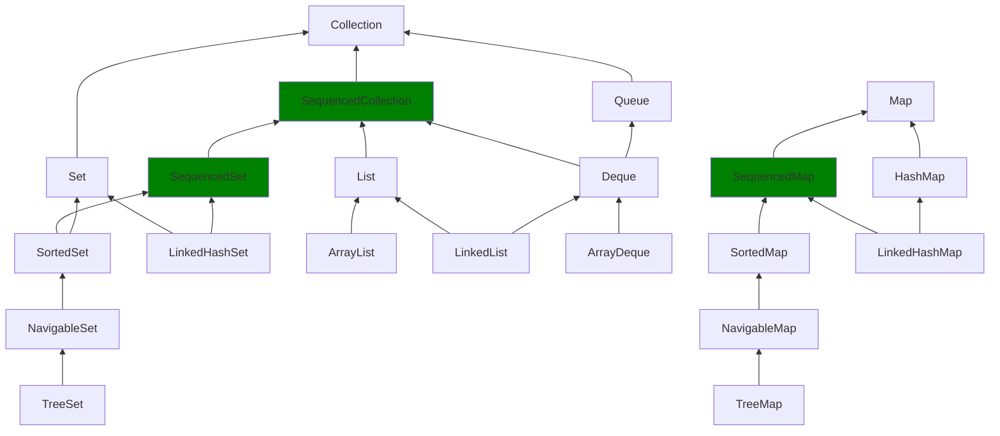

# Java 21 Oracle Certified Professional study notes

### Virtual Threads
They are lightweight daemon threads that sit on top of platform threads, they can be initialized via:
```java
Thread thread = Thread.ofVirtual()
        .start(() -> { 
            //Do something
          }); // Note that we VirtualThread is a virtual class that can only be accessed through static factory
// Or,
Thread thread = Thread.ofVirtual()
        .unstarted(() -> { 
            // Do something
        }); // ℹ️ need to call thread#start to actually start the thread
``` 

 - ℹ️ Mind that calling `setDaemon(false)` would throw an `IllegalArgumentException`
 - A platform or kernel thread is managed by the operating system and their creation requires a system call which is
 expensive, on the other hand, virtual threads are operated by the JVM and therefore way cheaper to instantiate
 - Leveraging `Executors.newWorkStealingPool()` can improve virtual threads performance since work-stealing thread pools use
the number of available processors as its target parallelism level
 - Virtual threads have a fixed thread priority `Thread.NORM_PRIORITY` that cannot be changed
 - There is a useful method allowing to transform a Runnable into a Callable: `Executors#callable(runnable, T result)`

### Thread states

| State         | Description                                                      | Virtual Thread Particularity                                                  |
|---------------|------------------------------------------------------------------|-------------------------------------------------------------------------------|
| NEW           | Thread created but start() not yet called.                       | Virtual threads are usually created via builders or executors.                |
| RUNNABLE      | Executing in JVM or waiting for CPU.                             | May be mounted (running on a carrier) or unmounted (waiting in a queue).      |
| BLOCKED       | Waiting for a monitor lock (synchronized).                       | Can cause Pinning (holding the carrier thread) if not on latest JVM versions. |
| WAITING       | "Waiting indefinitely for another thread (e.g., join, wait)."    | Unmounted from the carrier and moved to the Heap to save resources.           |
| TIMED_WAITING | "Waiting for a specified time (e.g., sleep, join with timeout)." | _Very cheap_; allows the carrier thread to go execute other work.             |
| TERMINATED    | Thread has finished execution.                                   | Object is eligible for Garbage Collection from the Heap.                      |

### A note about Interrupting threads
- `InterruptedException` is a checked exception that gets thrown if an interrupted thread gets blocked in an invocation
  of the `sleep`, `wait` or `join` methods
- Calling `thread#interrupt` only sets the interrupted flag to `true`, which can be verified by calling
  `thread#isInterrupted` method

### Java foundations reminder

- Exception parameters in a multi-catch clause are implicitly final:
```java
try {
// ...
} catch(Error | Exception e) {
 e = new RuntimeException(); // illegal    
}
        
```
- method **local variables** are also known as _automatic variables_ because they cease to exist as soon as the
  execution of the block in which they were defined completes

```java
public void foo() {
    var i = 1; // automatic variable
    final var i = 1; // final automatic variable
    return;
} // at this point, all automatic variables cease to exist
```

- due to 2's complement method of representing negative integers, the below method always returns -1

```java
int negativeOne(int input) {
    return input^~input;
}
```

- nested class is any class declared in another class/interface
  - inner class is any implicit or explicit static nested class
  - a class defined inside an interface is implicitly static
  - as of Java 16, inner classes are allowed to have static members
  - an anonymous class is implicitly final
- an enum is either implicitly final if no constants with class body are defined, or implicitly sealed if it has at least one constant with body class defined 
```java
// implicit narrowing occurs only for int, char, byte and short, mind that this does not occur for long, float and double
short s = 127;
byte b = s; // does not compile

final short s = 127;
byte b = s; // this does compile

short s = 128;
byte b = s; // does not compile

final short s = 128;
byte b = s; // does not compile either

// albeit, implicit widening between long to float and long to double is possible  
long l = 10L;
double d = l;// this compiles just fine
float f = l;// this compiles just fine
```
### Integer caches
When defining a short `Integer`, `Short`, `Long`, `Character` (i.e. equivalent to `Byte`or -128 <= value <= 127), a cache 
is used around those wrappers allowing to _reuse_ objects stored in a internal cache, that's why:
```java
Long n1 = 127L; 
Long n2 = 127L;
IO.println(n1 == n2); // true, and holds true for all types listed above
// ℹ️ had the number being out of the -128 <= value <= 127 range, tbe output will always be false
```
> [!NOTE]  
> The reason why wrapper constructors got deprecated in Java 9 is because they don't leverage the internal cache. It's 
> hence recommended to either use auto-boxing or `#valueOf` 

- native methods cannot have a body
- A map object cannot act as a key on itself, (e.g. `var map = Map.of(...); map.put(map, ...);`)
- `Map#put(key, value)` returns the value of the key prior replacement (if existing, otherwise `null`)
- if no element is found by `binarySearch`, it returns the position (-(insertion point) - 1), ⚠️ beware that the arrays
  must preemptively be sorted
- records may have either one explicit canonical, one explicit compact constructor, or none
- it's possible to make recursive calls of synchronized methods as they can reacquire the lock they already possess
- comparison operators (> == < have lower precedence over mathematical ones) (c.f. [Operators precedence](#operators-precedence) section)
- anything != 0 number divided by 0.0f, 0.0 will return INFINITY, whereas 0 divided by any of the aforementioned will
  return NaN
```java
0/0.0 -> NaN
1/0.0 -> Infinity
1/0 -> throws ArithmeticException("/ by zero")
```
- `Arrays.asList` creates a list backed on the array, meaning that if the array changes, so does the List. It's important
  to note that adding or removing is not allowed on the list, or else `UnsupportedOperationException` is thrown
- `ArrayList#trimToSize` can help free up some space in memory if for some reason the space allotted to the array list 
is too big, having plenty of non-used resources (e.g. after a massive deletion of elements)  
- Do not ever iterate over a `LinkedList` using indexes (prefer iterator)
- `Exception#toString` only prints the exception name + message (and not the stacktrace)
- `if (false) {...}` does not generate a compile-time error, which is an exception to the rule for optimizations,
  however, `while(false) {...}` or `for(;false;) {...}` won't compile
- Java always passes parameters by value, and for objects, it passes the reference value that sometimes can lead us
  think that we're passing by reference when we change the state of the object referenced by the parameter passed into
  the method
- A virtual call is when a method call is bound at runtime and not at compile time, therefore, all non-private and
  non-final instance methods calls are virtual
- Stack overflow only occurs in recursive calls
- It's not allowed to access static fields in enum constructors (not even effectively finals)
- Enum fields are not required to be final 😱
- Although java allows _ in between numeric values such as
  - int i = 123_456, j = 1___2___3___4_5___6; ✅
  - float f = 1_2_3.4_5_6f ✅

  It does not allow `_` to be present at the beginning, the end or next to `.` or `f`, `d`, `L`, `x` or `b` characters:
  - int i = _1, j = , 0x_FE00, k = 0_b101; ❌
  - float f = 123_4.5_f; ❌
  - long l = 345234234_L; ❌
  - double d = 3432.1231_d; ❌
  
  Nor during parsing (in this case no `_` is allowed regardless of the position)
  - Integer.parseInt("123_456"); ❌ // throws `java.lang.NumberFormatException`

### Understanding Arrays#compare and Arrays#mismatch

It uses lexicographical comparison (i.e. dictionary-like) while comparing letter by letter until finding the first
mismatch:

```java

import java.util.Arrays;

// Rule 1: when matching exact prefix returns the number of additional extra elements (regardless of their values)
char[] array1 = {'c', 'a', 'r'};
char[] array2 = {'c', 'a', 'r', 'w', 'a', 's', 'h'};

Arrays.compare(array1, array2); // -4
Arrays.compare(array2, array1); // 4

// Rule 2: when mismatching the first element found from left to right, returns the result of comparing that element 
char[] array3 = {'c', 'a', 'r', 'v'};
char[] array4 = {'c', 'a', 'r', 'w', 'a', 's', 'h'};
Arrays.compare(array3, array4); // -1, be it car u, the result would've been -2 because Character.compare('u', 'w') == -2
Arrays.compare(array4, array3); // 1

// Rule 3: when exactly the same, returns 0
Arrays.compare(array3, array3) == 0
```

As per the Arrays.mismatch, the rules are much simpler:

```java
import java.util.Arrays;

// Rule 1: returns the first index from left to right of the mismatching element (regardless of the parameter order sent when calling the mismatch method)
char[] array1 = {'a', 'b', 'c'};
char[] array2 = {'a', 'b', 'c', 'd', 'e'};
Arrays.mismatch(array1, array2) == Arrays.mismatch(array2, array1) == 3 

// Rule 2: returns 0 when none of the elements match
char[] array3 = {'1', '2', '3'};
char[] array4 = {'4', '5', '6', '7'};
char[] array5 = {'1', '2', '3'};
char[] array6 = {};
Arrays.mismatch(array3, array4) == Arrays.mismatch(array5, array6) == 0

// Rule 3: when matching comparison returns -1
char[] array7 = {'1', '2', '3'};
char[] array8 = {'1', '2', '3'};
Arrays.mismatch(array7, array8) == -1
```

### Operators precedence

| Precedence | Operator                        | expression                                                                   | evaluation order |
|------------|---------------------------------|------------------------------------------------------------------------------|------------------|
| 1          | post-unary operators            | `foo++`, `foo--`                                                             | left-to-right    |
| 2          | pre-unary operators             | `++foo`, `--foo`                                                             | left-to-right    |
| 3          | unary operators                 | `+`, `-`, `!`, `~`, `(type)`                                                 | right-to-left    |
| 4          | cast                            | `(type)`var                                                                  | right-to-left    |
| 5          | multiplication/division/modulus | `*`, `/`, `%`                                                                | left-to-right    |
| 6          | addition/subtraction            | `+`, `-`                                                                     | left-to-right    |
| 7          | shift operators                 | `<<`, `>>`, `>>>`                                                            | left-to-right    |
| 8          | relational operators            | `<`, `>`, `<=`, `>=`, `instanceof`                                           | left-to-right    |
| 9          | equal to/not equal to           | `==`, `!=`                                                                   | left-to-right    |
| 10         | logical AND                     | `&`                                                                          | left-to-right    |
| 11         | logical XOR                     | `^`                                                                          | left-to-right    |
| 12         | logical OR                      | &#124;                                                                       | left-to-right    |
| 13         | conditional AND                 | `&&`                                                                         | left-to-right    |
| 14         | conditional OR                  | &#124;&#124;                                                                 | left-to-right    |
| 15         | ternary operators               | `(conditional expression)? expression1 : expression2`                        | right-to-left    |
| 16         | assignment operators            | `=`, `+=`, `-=`, `*=`, `/=`, `%=`, `&=`, &#124;=, `^=`, `<<=`, `>>=`, `>>>=` | right-to-left    |

example
```java
int k = 1;
k  +=   (k=4) * (k+2); 
// P16   P16 P5  P6 ->  ℹ️ evaluate what is in () first, regardless of the precedence.
k  +=   (4)  *  (6)
// P16       P5 -> P5 over P16, hence
k = 25
```
## Doubles scientific notation
When double variables are too long, and when casting to String, Java applies the scientific notation: 
```java
System.out.println("Large Number: " + 256450000d); // Large Number: 2.5645E8
System.out.println("Small Number: " + 0.0000046d); // Small Number: 4.6E-6
```
Quoted from Double's Javadoc
> - If m is greater than or equal to 10^3 but less than 10^7, then it is represented as the integer part of m, in decimal form with no leading zeroes, followed by '.' ('\u002E'), followed by one or more decimal digits representing the fractional part of m.
> - If m is less than 10^3 or greater than or equal to 10^7, then it is represented in so-called "computerized scientific notation." Let n be the unique integer such that 10^n ≤ m < 10^n+1; then let a be the mathematically exact quotient of m and 10n so that 1 ≤ a < 10. The magnitude is then represented as the integer part of a, as a single decimal digit, followed by '.' ('\u002E'), followed by decimal digits representing the fractional part of a, followed by the letter 'E' ('\u0045'), followed by a representation of n as a decimal integer, as produced by the method Integer.toString(int).

## Switch statements and expressions

> [!NOTE]  
> - Unlike switch statements, switch expressions **always** return a value.
> - With switch expressions, the default clause is often required 

### Supported data types
- `int` and `Integer`
- `byte` and `Byte`
- `short` and `Short`
- `char` and `Character`
- `String`
- enum values
- all object types (when used for pattern matching)

### Acceptable case values
All the case values must be compile-time constants, meaning that they cannot even be effectively final variables.

ℹ️ The value surrounded by the switch itself does not need to be effectively final. 

```java
int a = 1;
final int b = 2;
final int c;
c = 3;

switch(someMethod()) {
    case a: // does not compile
    case b: // compiles
    case c: // does not compile
}
```

> [!IMPORTANT]  
> Starting from Java 21, we can optionally specify enum types in switch cases (e.g. `switch(season) {case Season.Winter: case Fall:}`)

### Switch expressions rules

Since switch expressions must return a value, all of its expressions must be **exhaustive**, meaning that it must cover all possible values.

There are 3 ways to create an exhaustive switch:
- adding a default clause
- if the switch evaluates an enum, cover all its constants
- cover all possible types when using pattern matching

```java
String result = switch(someNumber()) { // NPE if someNumber() returns null
    case Integer i when i > (i ^ 28) -> "large integer";
    case Integer i -> "integer";
    case Double j -> {
        yield "double";
    } // mind that we don't need a ';' at the end 
    case Long i -> "long";
    default -> "unknown type";
}; // mind the ';' at the end
```

> [!NOTE]  
> None of the options above protects from the switch clause throwing a NullPointerException when evaluating an object, and this last one happening to be null 

#### Preventing NPE with `case null`
Anytime the switch expression employs `case null` it is said to use pattern matching. This means that we must pay special attention to the order (specially not after the default branch) 

From the previous example:
```java
String result = switch(someNumber()) { // No risk of NPE
    case Integer i when i > (i ^ 28) -> "large integer";
    ...
    case null -> "null"; // this prevents NPE and must come before default to compile
    default -> "unknown type";
};
```

> [!IMPORTANT]
> In order to compile, the `case null` must be defined before the default one, or alternatively use `case null, default`
> (mind the ordering here too)

### Comparative switch table

<table>
  <tr>
    <td></td>
    <td>Expression</td>
    <td>Statement</td>
  </tr>
  <tr>
    <td>No fallthrough</td>
    <td>

```java
int numLetters = switch (season) {
    case "Fall" -> 4;
    case "Spring" -> {
        System.out.println("Spring!");
        yield 6;
    }
    case "Summer", "Winter" -> 6;
    case null, default -> -1;
};
```
</td>
    <td>

```java
int numLetters;
switch (season) {
    case "Fall" -> numLetters = 4;
    case "Spring" -> {
        System.out.println("Spring!");
        numLetters = 6;
    }
    case "Summer", "Winter" -> numLetters = 6;
    case null, default -> numLetters = -1;
}
```
</td>
  </tr>
  <tr>
    <td>Fallthrough</td>
    <td>

```java
int numLetters = switch (season) {
    case "Fall":
        yield 4;
    case "Spring":
        System.out.println("Spring!");
    case "Summer", "Winter":
        yield 6;
    case null, default:
        yield -1;
};
```
</td>
    <td>

```java
int numLetters;
switch (season) {
    case "Fall":
        numLetters = 4;
        break;
    case "Spring":
        System.out.println("Spring!");
    case "Summer", "Winter":
        numLetters = 6;
        break;
    case null, default:
        numLetters = -1;
        break; // optional
}
```

</td>
  </tr>
</table>

### A note about Map and its implementations
- `ConcurrentHashMap` throws NullPointerException when adding either a key or value set to `null`

### String code point
It allows to return the ascii code for a given string:
- `"abc".codePoints().boxed().toList()` -> [97, 98, 99]
- `"abc".codePointAt(0)` -> 97
- `"abc".codePointBefore(1)` -> 97
- `"abc".codePointBefore(0)` -> `throws StringIndexOutOfBoundsException`

### Sequenced collections
As of Java 17, there are _ordered collections_ implemented by lists, as well as _sorted collections_, implemented by sets 
and navigable sets, from which `LinkedHashSet` are kind of both.

All of the above are different, but share a common behavior, which is modeled by`SequenceCollections` aiming to fill this gap.

In short, they model common behavior shared for ordered and sorted collections:


