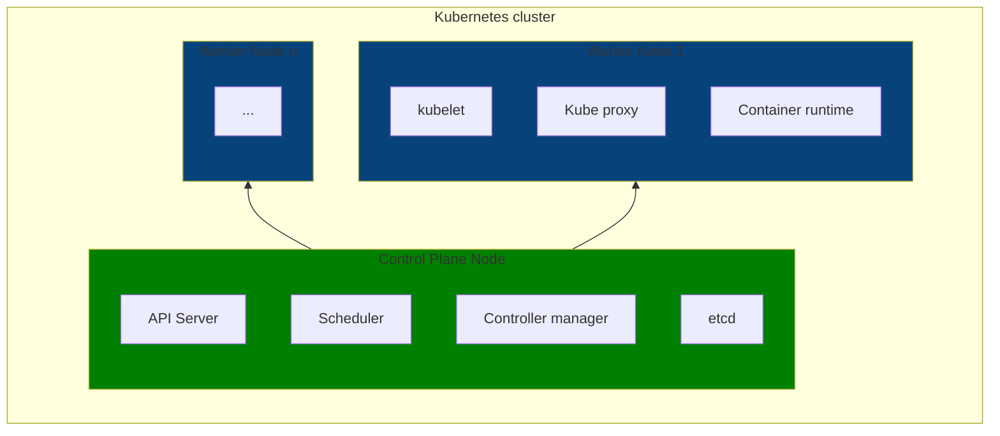
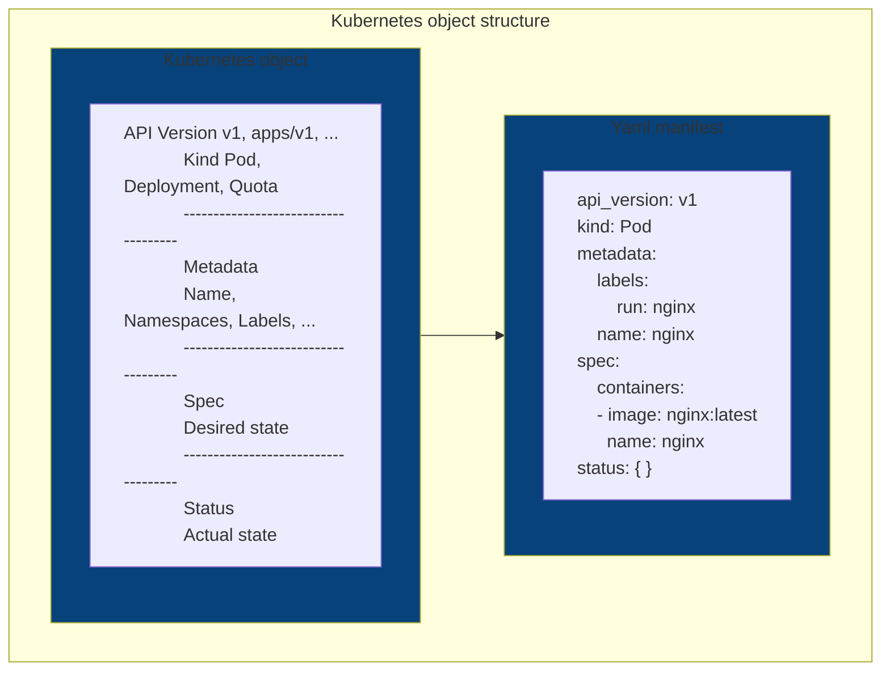

# CKAD studying notes

### Kubernetes high-level architecture

Kubernetes is a production-ready runtime environment for managing containerized applications at scale. Ideally for operating 
microservice architectures, it also supports non-functional requirements such load balancing, security and scalability.  


- **Control plane node** → exposes the Kubernetes API via the API server and manages the nodes within the cluster. 
It also responds to cluster events 
  - **API server** → the exposed endpoints to communicate with the cluster
  - **Scheduler** → a process that identifies new non-assigned-node pods to assign them to a worker node for execution 
  - **Controller manager** → checks the state of the cluster and implements changes
  - **Etcd** → a key-value store used to persist all data related to the cluster 
- **Worker node** → executes workloads in containers within pods. Each work node must have a container runtime engine 
to be able to manage containers
  - **kubelet** → agent that makes sure that containers are running in a pod, in other words, it links Kubernetes to the
container runtime engine by ensuring that containers are running healthy. It can also be present in the control plane
node although inconventional
  - **Kube proxy** → network proxy allowing network communication and keeping network rules. It also implements the
svc
  - **Container runtime** → responsible for managing containers 

#### Objects


- **API  version** → defines the structure of the primitive
- **Kind** → defines type of primitive
- **Metadata** → contains higher-level information about the object, such as label and name
- **Spec** → defines the desired state after the object has been created 
- **Status** → describes the actual state of the object. If no status is set, its value is `{}`

## kubectl 

```shell
kubectl [command] [type] [name] [flags]
          get       po    app   -o yaml
          run            myPod  --image=nginx --port=80
```

### Updating objects
```shell
kubectl edit po myPod
kubectl patch po myPod -p '{"spec":{"containers":[{"name":"myPod", "image":"nginx:1.25"}]}}'
kubectl delete po myPod --now # forces deletion disabling graceful deletion  
```

### Creating objects
```shell
kubectl apply -f deployment.yaml # creates an object from a manifest file
kubectl apply -f /creation # creates object(s) from a directory containing manifest files
kubectl apply -f /root -R  # creates object(s) from a directory containing manifest files recursively
kubectl apply -f https://raw.githubusercontent.com/tejada7/deployment.yaml # creates an object from a URL 
```

### Hybrid approach
```shell
kubectl run myPod --image=nginx \
 --port=80 \
 -o yaml \
 --dry-run=client > pod.yaml
```
