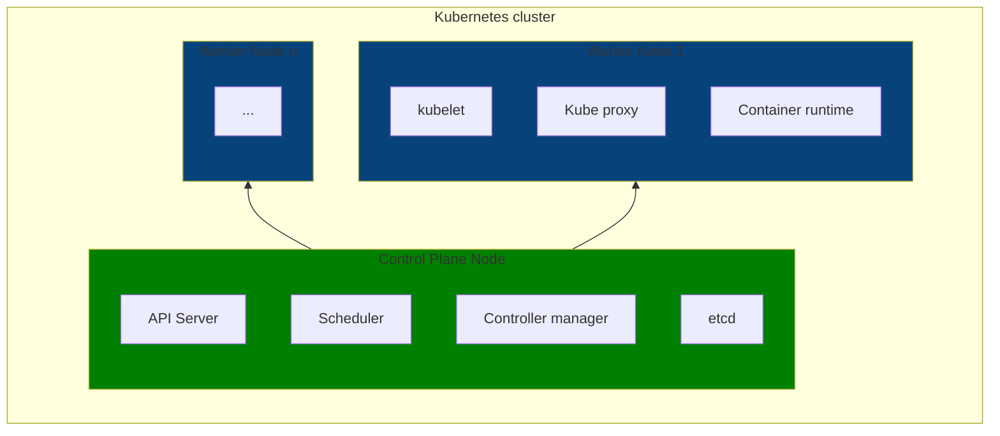
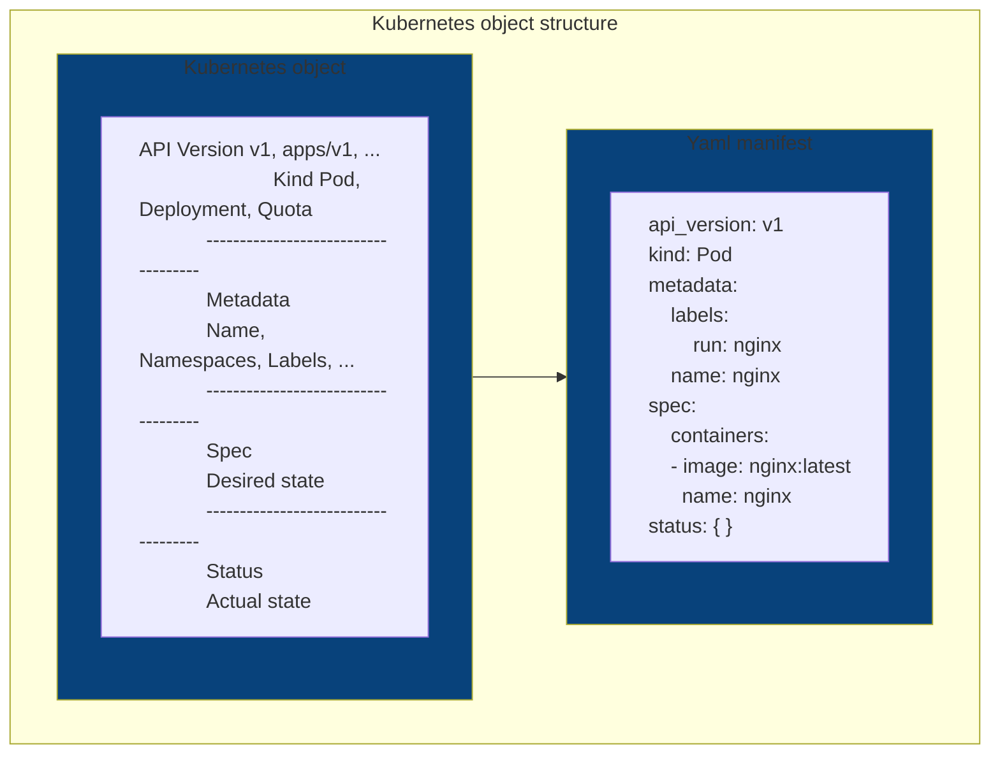
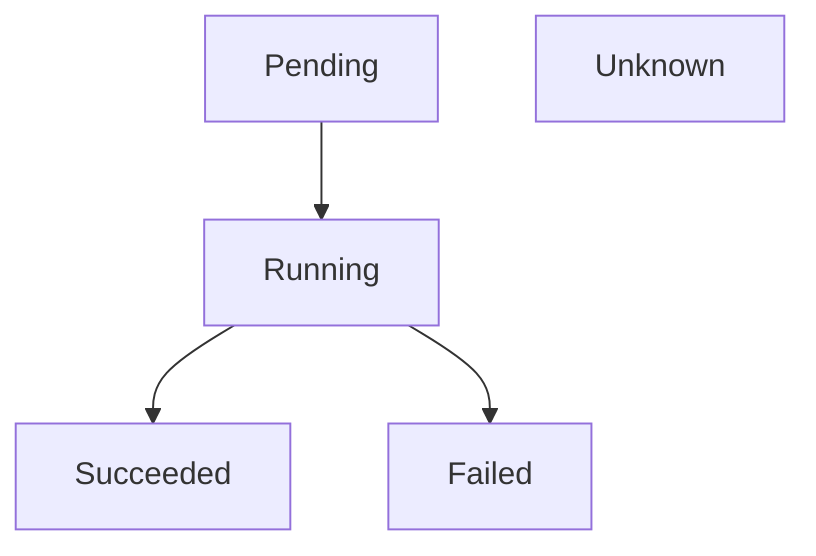

# CKAD studying notes

### Kubernetes high-level architecture

Kubernetes is a production-ready runtime environment for managing containerized applications at scale. Ideally for
operating microservice architectures, it also supports non-functional requirements such load balancing, security and 
scalability.



- **Control plane node** → exposes the Kubernetes API via the API server and manages the nodes within the cluster.
  It also responds to cluster events
    - **API server** → the exposed endpoints to communicate with the cluster
    - **Scheduler** → a process that identifies new non-assigned-node pods to assign them to a worker node for execution
    - **Controller manager** → checks the state of the cluster and implements changes
    - **Etcd** → a key-value store used to persist all data related to the cluster
- **Worker node** → executes workloads in containers within pods. Each work node must have a container runtime engine
  to be able to manage containers
    - **kubelet** → agent that makes sure that containers are running in a pod, in other words, it links Kubernetes to
      the
      container runtime engine by ensuring that containers are running healthy. It can also be present in the control
      plane
      node although inconventional
    - **Kube proxy** → network proxy allowing network communication and keeping network rules. It also implements the
      svc
    - **Container runtime** → responsible for managing containers

#### Objects



- **API version** → defines the structure of the primitive
- **Kind** → defines type of primitive
- **Metadata** → contains higher-level information about the object, such as label and name
- **Spec** → defines the desired state after the object has been created
- **Status** → describes the actual state of the object. If no status is set, its value is `{}`

## kubectl

```shell
kubectl [command] [type] [name] [flags]
          get       po    app   -o yaml
          run            my_pod  --image=nginx --port=80
```

```shell
kubectl api-resources # find all available commands with their abbreviations
kubectl config view 
```

### Updating objects

```shell
kubectl edit po my_pod
kubectl patch po my_pod -p '{"spec":{"containers":[{"name":"my_pod", "image":"nginx:1.25"}]}}'
kubectl delete po my_pod --now # forces deletion disabling graceful deletion  
```

### Creating objects

```shell
kubectl apply -f deployment.yaml # creates an object from a manifest file
kubectl apply -f /creation # creates object(s) from a directory containing manifest files
kubectl apply -f /root -R  # creates object(s) from a directory containing manifest files recursively
kubectl apply -f https://raw.githubusercontent.com/tejada7/deployment.yaml # creates an object from a URL 
```

### Hybrid approach

```shell
kubectl run my_pod --image=nginx \
 --port=80 \
 -o yaml \
 --dry-run=client > pod.yaml # mind that --dry-run without any value is deprecated
 --labels=app=backend,env=dev
```

### Getting container runtime

```shell
kubectl get nodes -o wide
```

### Pod life cycle phases



- **Pending** → the pod has been accepted by the Kubernetes cluster, but containers aren't being created
- **Running** → at least one container is running, or is starting or restarting
- **Succeeded** → all containers in the pod terminated successfully
- **Failed** → at least one pod failed with an error
- **Unknown** → the state of the pod could not be obtained

ℹ️ Pod's default restart policy (i.e. `spec.template.spec.restartPolicy`) is `Always`, which tells Kubernetes scheduler
to *always* restart the pod even if the container exits.

### Pod details

```shell
kubectl describe po my_pod
kubectl get po my_pod
kubectl get po --show-labels
kubectl get po my_pod -o wide
kubectl get po my_pod -o yaml
```

### Accessing logs

```shell
kubectl logs my_pod
kubectl logs my_pod -f # follow logs in real time
kubectl logs my_pod --previous # logs of the previous run
kubectl logs my_pod -c container1 # logs of the container 1 in case of many within the Pod
```

### Executing commands in containers

```shell
kubectl exec -it my_pod -- /bin/sh
kubectl exec -it my_pod -- bash
kubectl exec my_pod -- env
```

ℹ️ `--` separates the `exec` command and its options from the command to be run inside the container

### Requesting an IP within a pod

```shell
# instead of wget, we could also use curl
kubectl run busybox --image=busybox --rm -it --restart=Never -- wget xxx.xxx.xxx.xxx:80 
```

These are equivalent:

```mermaid
flowchart TD
;
subgraph frame[ ]
    direction LR
    subgraph example1[ ]
        description1["
        apiVersion: v1
        kind: Pod
        metadata:
        #nbsp; #nbsp; name: my_pod
        spec:
        #nbsp; #nbsp; containers:
        #nbsp; #nbsp; - args:
        #nbsp; #nbsp; #nbsp; #nbsp; - /bin/sh
        #nbsp; #nbsp; #nbsp; #nbsp; - -c
        #nbsp; #nbsp; #nbsp; #nbsp; - while true; do date; sleep 10; done
        #nbsp; #nbsp; image: busybox:1.36.1
        #nbsp; #nbsp; name: my_pod"]
    end
    example1:::color
    description1:::alignLeft
    subgraph example2[ ]
        description2["
        api_version: v1
        kind: Pod
        metadata:
        #nbsp; #nbsp; name: my_pod
        spec:
        #nbsp; #nbsp; containers:
        #nbsp; #nbsp; - command: #91;#34;/bin/sh#34;#93;
        #nbsp; #nbsp; #nbsp; args: #91;#34;-c#34;, #34;while true; do date; sleep 10; done#34;#93;
        #nbsp; #nbsp; #nbsp; image: busybox:1.36.1
        #nbsp; #nbsp; #nbsp; name: my_pod"]:::yamlText
    end
    example2:::color
    example1 --> example2
    classDef color fill:#08421b;
    classDef yamlText text-align-last: left, text-align: justify, text-justify: distribute;
    classDef alignLeft text-align: left;
end
```


### Namespaces

```shell
kubectl config set-context --current --namespace=nsName
```

### Jobs and Cronjobs

ℹ️ There is a way to auto-cleanup for jobs by specifying the attribute `spec.ttlSecondsAfterFinished`

ℹ️ Jobs operate in three modes:

- non-parallel with one completion count (default)
- parallel with a fixed completion count
- parallel with worker queue

ℹ️ The attribute `spec.completions` controls the number of required successful completions, whereas the attribute
`spec.parallelism` allows execution in parallel

#### Creation

```shell
kubectl create job counter --image=nginx -- /bin/sh 
-c 'counter=0; while [$counter -lt 3 ]; do counter=$((counter+1)); echo "$counter"; sleep 3; done;'
```

```shell
kubectl create cronjob now --schedule="* * * * *" --image=nginx -- /bin/sh 
-c 'echo "Current date: $(date)"'
```

#### Getting number of completions

```shell
kubectl get jobs counter -o yaml | grep -C 1 "completions"
```

#### Restart behavior

ℹ️ The `spec.backoffLimit` attribute determines the number of retries a Job tries to successfully complete (i.e. exit
code = 0). It's defaulted to **6**

ℹ️ The restart policy of a Job can be either `OnFailure` or `Never`

### Volumes

- *Ephemeral volumes* exist only throughout the lifespan of the Pod. Useful when wanting to share data among multiple
  containers running within the same Pod. It gets cleaned up and reconstructed upon Pod restart
- *Persistent volumes* preserve data beyond the lifespan of a Pod

#### Common volume types

| Type                     | Description                                                                       |
|--------------------------|-----------------------------------------------------------------------------------|
| `emptyDir`               | Empty directory within the Pod with R/W access. Only valid for the Pod's lifespan |
| `hostPath`               | File or directory from the host node's filesystem                                 |
| `configMap`, `secret`    | Deals with configuration data                                                     |
| `nfs`                    | Network file system, preserves data after Pod restart                             |
| `persistenceVolumeClaim` | Claims a persistent volume                                                        |

To define an ephemeral volume:
```yaml
apiVersion: v1
kind: Pod
metadata:
  name: business-app
spec:
  volumes: # 1 define the volume name and its type
  - name: my-volume
    emptyDir: {}
  containers:
  - image: nginx
    name: nginx
    volumeMounts: # 2 the defined volume must be mounted to a path of the container
    - mountPath: /var/my-volume
      name: my-volume
```

#### Creating PersistentVolume
ℹ️ Every PersistentVolume needs to define the storage capacity (`spec.capacity`) as well as an access mode
(`spec.accessMode`)

⚠️ `kubectl` doesn't allow to create pv directly

```yaml
apiVersion: v1
kind: PersistentVolume
metadata:
  name: db
spec:
  capacity:
    storage: 1Gi
  accessModes:
    - ReadWriteOnce
  hostPath:
    path: /data/db
```

| Type               | Alias | Description                               |
|--------------------|-------|-------------------------------------------|
| `ReadWriteOnce`    | RWO   | Read/write access by a single node        |
| `ReadOnlyMany`     | ROX   | Read-only access by many nodes            |
| `ReadWriteMany`    | RWX   | Read/write access by many nodes           |
| `ReadWriteOncePod` | RWOP  | Read/write access mounted by a single Pod |

#### Creating PersistentVolumeClaim
Its purpose is to bind the PersistentVolume to the Pod.
```yaml
kind: PersistentVolumeClaim
apiVersion: v1
metadata:
  name: my-pvc
spec:
  accessModes:
    - ReadWriteOnce
  storageClassName: "" # important to leave as empty string if no storageClass to bind
  resources:
    requests:
      storage: 256Mi
```
The above definition looks for a PersistentVolume that can fulfill the resource request of 256Mi providing the mode 
`ReadWriteOnce`. If found, then the pvc status is set to `Bound` and the last step requires to bind the Pod to pvc:
```yaml
apiVersion: v1
kind: Pod
metadata:
  name: pod-consuming-pvc
spec:
  volumes:
    - name: pod-storage
      persistentVolumeClaim: # mind this section
        claimName: my-pvc # so does it, that must match the name of the previously created pvc
  containers:
  - image: nginx
    name: my-pod
    command: ["/bin/sh"]
    args: ["-c", "while true; do sleep 60; done;"]
    volumeMounts:
      - mountPath: "/tmp/data"
        name: pod-storage
```
### Multi-container pods
- **sidecar** → a container that enhances the primary application, for example logging 
- **ambassador** → a container that represents the primary container to the outside world, such as a proxy
- **adapter** → used to adopt the traffic or data pattern to match the traffic 

### Labels, selectors and annotations
```shell
kubectl describe describe pod labeled-pod  | grep -C 2 Labels:
kubectl get pods --show-labels
kubectl label pod labeled-pod region=bo # to add a label region to the existing pod
kubectl label pod labeled-pod region=eu --overwrite # overrides an existing label
kubectl label pod labeled-pod region- # removes the label region
kubectl get po -l key=value --show-labels # retrieve the pods with the label key=value, or --selector instead of -l
kubectl get po --selector 'key in (value1, value2)' # retrieve those pods whose key value is either value1 or value2 
```
Unlike labels (i.e. `metadata.labels`), annotations (i.e. `metadata.annotations`) cannot be added via `kubectl run 
--label=...`; however, what can be done is modification:
```shell
kubectl annotate pod my-pod key='value'
kubectl annotate pod my-pod key='value1' --overwrite
kubectl annotate pod my-pod key-
```
### Pod security standards

Configurable via the `pod-security.kubernetes.io/enforce: "baseline"`annotation 

| Profile     | Description                 |
|-------------|-----------------------------|
| Privileged  | Unrestricted policy         |
| Baseline    | Minimally restricted policy |
| Restrictive | Heavily restricted policy   |

### Deployments
When creating a deployment imperatively (i.e. `kubectl create deploy deploy-name ...`), `app` is the label key used by
the deployment to identify the related replicas and pods. It can be find in three different sections of the manifest:
- `metadata.labels`
- `spec.selector.matchLabels`
- `spec.template.metadata.labels`

ℹ️ For label selection to work properly, the last two of the above must match.

#### Updating a deployment
```shell
kubectl edit deployment my-deployment
kubectl set image deployment my-deployment container-name:new-image
kubectl patch deployment my-deployment -p '{"spec": "template": {"spec": {"containers": [{"name": "nginx", "image":"newImage"}]}}}}'
```

ℹ️ The *rolling update strategy* consists in the deployment taking care of updating all replicas to the new version one at 
a time.

```shell
kubectl rollout status deploy my-deployment # checks whether all the replicas were successfully rolled out
kubectl rollout history deploy my-deployment # gets the history of rollouts in sequential order (i.e. revision 1 was before revision 2 and so on...)
kubectl rollout history deploy my-deployment --revision 1 # gets the detailed description of the revision 1
```

#### Deployment strategies

| Type                               | Description                                                                                                                                                                                                                                                                                        |
|------------------------------------|----------------------------------------------------------------------------------------------------------------------------------------------------------------------------------------------------------------------------------------------------------------------------------------------------|
| Ramped - `RollingUpdate` (default) | It means that two versions of the same application coexist during update process. In that sense, it's advisable to develop backward-compatible applications.                                                                                                                                       |
| Fixed - `Recreate`                 | Kills all pods first, then creates Pods with the newest version. ⚠️ Beware of downtime                                                                                                                                                                                                             |
| Blue-green aka red-back            | Two deployments in parallel: blue represents the old version, and green the new one, upon validation of the green version, the svc can now target the green deployment and hence scale down or delete the blue one. This strategy is convenient for complex upgrades without downtime to consumers |
| Canary                             | Similar to the blue-green deployment in the sense that two deployments co-exist. The only difference is that the newer version is targeted to a subset of consumers. This is useful for experimental features                                                                                      |

#### Adding change cause for revision
```shell
kubectl annotate deployment my-deployment kubernetes.io/change-cause="reason for the rollout"
```

#### Rolling back to a previous revision
```shell
kubectl rollout undo deploy my-deployment --to-revision=1 # rolls back deployment to revision 1
```

#### Scaling 
```shell
kubectl scale deploy my-deployment --replicas=3 # scales up the number of replicas to 3
```
#### Horizontal Pod auto scaler (HPA)
```shell
kubectl autoscale deploy my-deployment --cpu-percent=80 --min=3 --max=5
```
### Helm
It's a templating engine and package manager for Kubernetes. 
Charts can be found at [https://artifacthub.io/](https://artifacthub.io/)

```shell
helm repo add my-repo https://charts.my-repo.io # downloads the repo

helm install foo foo/my-repo --version 1.0.0 # installs foo with version 1.0.0

helm install foo foo/my-repo --version 1.0.0 --set spec.username=boss --set spec.password=password -n custom-ns --create-namespace # installs foo with version 1.0.0, overloading the properties username and password, as well as creating the namespace custom-ns 

helm repo update
helm upgrade foo foo/my-repo --version 2.0.0 # upgrades the chart to version 2.0.0

helm uninstall foo # uninstalls the chart 
``` 
