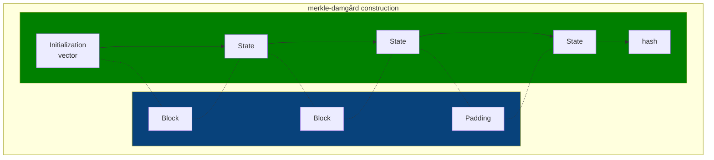

# Security principles
- **Hash functions** help us to verify that a file has not been tampered with or protect passwords in an irreversible manner.
- **Symmetric encryption** provides privacy between two or more people 
- **Asymmetric encryption** allows to establish private communication without having to share a secret by other parties
- **Block cyphers** extend symmetric encryption to larger files  
- **Public key infrastructure** and **digital certificates** allow to establish identity, proof authorship and build digital trust

- **Salt** is the term for a random piece of information that is mixed in before computing the hash

## Hashing
They are relatively fast to compute, deterministic, and designed to be one way (i.e. irreversible).
### Checking file hash
To verify is a downloaded file has been tampered with, it suffices to:
```shell
cat downloaded-file.tgz | openssl dgst -sha512 # this computes the hash of the file and display it in hexadecimal format
```
The output of the command should match the hash shown on the source website from where the file was downloaded.

> [!NOTE]
> #### A note about information theory 
> The number of bits in a message is the 
> $$log_2(possibleStates) $$ 
> as long as all possible states are equally likely.
> 
> The amount of information conveyed by choice, measured in bits, is called entropy:
> $$H = - \sum_{i=1} p_i log_2(p_i) $$
> a message with **low entropy**, contains redundancy, or in other words, it's easily **predictable**. On the other 
> hand,a message with high entropy, becomes much more complex guess, and therefore **unpredictable**  

### Compression functions

It starts with an initialization vector, the function takes the init vector and the first block of the message and 
produces the next state, and then that state is passed to the function again along with the next block of the message.

Each pass through the compression function reduces the information of the message, reason why it's called *compression 
function*.

At the end, padding is applied to the last block of the message and then a finalization function is applied, the **result 
is the hash**.


> [!WARNING]
> The compression function of MD5 is susceptible to collisions, meaning that with brute-force attacks, it'd require 
> a **2^18**, or a few seconds with modern devices.
> 
> For that reason **MD5 is no longer considered a cryptographically strong hash function**.

### Secured Hash Algorithms (SHA)
The first 2 versions of SHA were developed by the NSA (US National Security Agency).
- SHA-1 dates from 1995, it was an improvement over MD5, increasing collision resistance:
  - 80 rounds
  - 160-bit state
  - 512-bit block
   
  → **Deprecated since 2011**
- SHA-2 dates from 2001, with much more improvements 
  - 64-80 rounds
  - 224-512-bit digest
  - 256-512-bit state (first time that internal state was larger than digest)
  - 512-1024-bit blocks

  → **still considered safe as of now**, they are nonetheless susceptible to length extension attacks  
- SHA-3 standard came out in 2012, deviates from merkle-damgård construction
  - 24 rounds
  - 1600-bit state
  - 578-1152-bit blocks
  - not susceptible to length extension attacks
  - not wide adopted unlike SHA-2

### Json web tokens
- a claim is a piece of information that the issuer or authorization server can vouch for 
#### Header
```json
{
  "alg": "HS256",
  "typ": "JWT"
}
```
Base-64-encoded version:
```shell
eyAiYWxnIjogIkhTMjU2IiwidHlwIjogIkpXVCJ9
```

#### Payload
```json
{
  "sub": "f9d37544-dad0-48bd-b3eb-02202580cbab",
  "name": "John",
  "email": "john@doe.com",
  "role": "admin"
}
```
Base-64-encoded version:
```shell
ewogICJzdWIiOiAiZjlkMzc1NDQtZGFkMC00OGJkLWIzZWItMDIyMDI1ODBjYmFiIiwKICAibmFtZSI6ICJKb2huIiwKICAiZW1haWwiOiAiam9obkBkb2UuY29tIiwKICAicm9sZSI6ICJhZG1pbiIKfQ==
```
The signature is where the secure hash function comes in:
1. the issuer concatenates the header with the payload to come up with a hash-based message authentication code or HMAC:
2. the header and payload are appended to the secret that only the issuer knows XOR'd with a constant1
3. that combined message is hashed, typically with SHA-256
4. that result is appended to the secret again, this time XOR'd with a different constant2
5. then everything is hashed a second time, the fact of hashing twice protects against length extension attacks
   
$$firstHash=hashSha256(XOR(secret.append(String.concat(payload,signature), constant1))$$
$$jwt=hashSha256(XOR(secret.append(firstHash), constant2))$$
