# Security principles
- **Hash functions** help us to verify that a file has not been tampered with or protect passwords in an irreversible manner.
- **Symmetric encryption** provides privacy between two or more people 
- **Asymmetric encryption** allows to establish private communication without having to share a secret by other parties
- **Block cyphers** extend symmetric encryption to larger files  
- **Public key infrastructure** and **digital certificates** allow to establish identity, proof authorship and build digital trust

- **Salt** is the term for a random piece of information that is mixed in before computing the hash

## Hashing
They are relatively fast to compute, deterministic, and designed to be one way (i.e. irreversible).
### Checking file hash
To verify is a downloaded file has been tampered with, it suffices to:
```shell
cat downloaded-file.tgz | openssl dgst -sha512 # this computes the hash of the file and display it in hexadecimal format
```
The output of the command should match the hash shown on the source website from where the file was downloaded.

> [!NOTE]
> #### A note about information theory 
> The number of bits in a message is the 
> $$log_2(possibleStates) $$ 
> as long as all possible states are equally likely.
> 
> The amount of information conveyed by choice, measured in bits, is called entropy:
> $$H = - \sum_{i=1} p_i log_2(p_i) $$
> a message with **low entropy**, contains redundancy, or in other words, it's easily **predictable**. On the other 
> hand,a message with high entropy, becomes much more complex guess, and therefore **unpredictable**  

### Compression functions

It starts with an initialization vector, the function takes the init vector and the first block of the message and 
produces the next state, and then that state is passed to the function again along with the next block of the message.

Each pass through the compression function reduces the information of the message, reason why it's called *compression 
function*.

At the end, padding is applied to the last block of the message and then a finalization function is applied, the **result 
is the hash**.


> [!WARNING]
> The compression function of MD5 is susceptible to collisions, meaning that with brute-force attacks, it'd require 
> a **2^18**, or a few seconds with modern devices.
> 
> For that reason **MD5 is no longer considered a cryptographically strong hash function**.

### Secured Hash Algorithms (SHA)
The first 2 versions of SHA were developed by the NSA (US National Security Agency).
- SHA-1 dates from 1995, it was an improvement over MD5, increasing collision resistance:
  - 80 rounds
  - 160-bit state
  - 512-bit block
   
  → **Deprecated since 2011**
- SHA-2 dates from 2001, with much more improvements 
  - 64-80 rounds
  - 224-512-bit digest
  - 256-512-bit state (first time that internal state was larger than digest)
  - 512-1024-bit blocks

  → **still considered safe as of now**, they are nonetheless susceptible to length extension attacks  
- SHA-3 standard came out in 2012, deviates from merkle-damgård construction
  - 24 rounds
  - 1600-bit state
  - 578-1152-bit blocks
  - not susceptible to length extension attacks
  - not wide adopted unlike SHA-2

### Json web tokens
- a claim is a piece of information that the issuer or authorization server can vouch for 
#### Header
```json
{
  "alg": "HS256",
  "typ": "JWT"
}
```
Base-64-encoded version:
```shell
eyAiYWxnIjogIkhTMjU2IiwidHlwIjogIkpXVCJ9
```

#### Payload
```json
{
  "sub": "f9d37544-dad0-48bd-b3eb-02202580cbab",
  "name": "John",
  "email": "john@doe.com",
  "role": "admin"
}
```
Base-64-encoded version:
```shell
ewogICJzdWIiOiAiZjlkMzc1NDQtZGFkMC00OGJkLWIzZWItMDIyMDI1ODBjYmFiIiwKICAibmFtZSI6ICJKb2huIiwKICAiZW1haWwiOiAiam9obkBkb2UuY29tIiwKICAicm9sZSI6ICJhZG1pbiIKfQ==
```
The signature is where the secure hash function comes in:
1. the issuer concatenates the header with the payload to come up with a hash-based message authentication code or HMAC:
2. the header and payload are appended to the secret that only the issuer knows XOR'd with a constant1
3. that combined message is hashed, typically with SHA-256
4. that result is appended to the secret again, this time XOR'd with a different constant2
5. then everything is hashed a second time, the fact of hashing twice protects against length extension attacks
   
$$firstHash=hashSha256(XOR(secret.append(String.concat(payload,signature), constant1))$$
$$jwt=hashSha256(XOR(secret.append(firstHash), constant2))$$

## Symmetric encryption
This allows to reverse the hiding mechanism. This is done by sharing a **secret key**. This key is used both to encrypt
and decrypt the message. Because this key is used in both directions, it's called a symmetric key.

```mermaid
flowchart TD
;
subgraph frame[ ]
    direction LR
    subgraph plaintext[ 📝 
    Plaintext]
    end
    subgraph symmetricKey[ 🔑 
    Symmetric Key]
    end
    subgraph ciphertext[ 🔐 
    Ciphertext]
    end
    ciphertext:::color
    plaintext --> symmetricKey
    symmetricKey --> ciphertext
    ciphertext --> symmetricKey
    symmetricKey --> plaintext
end
```


> [!NOTE]
> The ciphertext can be shared over untrusted communication channels, as an attacker won't be able to read the content 
> (i.e. plaintext) unless accessing the shared key.
> 
> For that reason the shared key **MUST BE PROTECTED**

#### Advanced Encryption Standard (AES)
It's the symmetric algorithm the is most commonly used nowadays. It essentially uses key expansion.
- Achieves high level of confusion
- It's considered strong enough

Example of encrypting a message:
```shell
# generating the random 32-bit key (mind that the key must be in hexadecimal as a requirement)
export SHARED_KEY=`openssl rand -hex 32` 

# encrypting text, this will generate some binary, stored in the ciphertext.enc file
echo "password" | openssl enc -aes-256-ecb -K $SHARED_KEY > ciphertext.enc

# to read the binary file
xxd ciphertext.enc

# to decrypt
openssl enc -aes-256-ecb -d -in ciphertext.enc -K $SHARED_KEY
```

#### Password-based Key Derivation Function (PBKDF2)
It computes a key using a passphrase, therefore, the main benefit is that the key does not need to be shared between
all parties, a passphrase suffices.

```shell
# encrypting, this will create a default salt and ask for a passphrase twice: 
echo "password" | openssl enc -aes-256-ecb -pbkdf2 > ciphertext.enc 
#...enter AES-256-ECB encryption password:

# decrypting, this will require the passphrase set in the previous step
# It does not need to know the salt as it's already in the ciphertext file
openssl enc -aes-256-ecb -d -in ciphertext.enc -pbkdf2
```
> [!TIP]
> The more the shared key is used, the more vulnerable it becomes, thus it's highly recommended to share it only between 
> two people and use it for only one message.
> 
> Secure algorithms provide a high level of confusion, making the relation between the shared key and the ciphertext too
> complicated to be broken down.

## Asymmetric encryption

| Symmetric                                                       | Asymmetric                                                          |
|-----------------------------------------------------------------|---------------------------------------------------------------------|
| Shared key to encrypt/decrypt                                   | One to encrypt, another to decrypt                                  |
| Secret must be shared over a different channel than the message | Shared secret can be established over an open communication channel |
| Extended to any length message                                  | Restricted to specific length                                       |
| Used to exchange messages                                       | Used to exchange symmetric keys                                     |

A key to making a good asymmetric algorithm is to find out a trapdoor function, allowing to easily go in one direction,
but really hard to go in another direction.

### Deriving a shared secret

Because exponentiation in a modulus is a trapdoor function used in asymmetric keys, giving the public key, does not give
the private key, example:

Let's imagine that we need to derive a shared secret between two personas: 
- we set a common `modulus` to 27
- we set a common `base` to 2
- we set a `first private key` to 7
- we set a `second private key` to 8

Now, to generate the first public key, we'll be using $${base}^{privateKey}_{mod {(modulus)}} $$ which will give us the public key.

Thus, for the first public key calculation: $$firstPublicKey=2^7_{mod 27} = 20$$

and, for the second public key calculation: $$secondPublicKey=2^8_{mod 27} = 13$$

```mermaid
flowchart TD
;
subgraph frame[ ]
    subgraph common[ ]
      subgraph calculusPersona1["$$publicKey2^{privateKey1}mod(27)=13^7mod(27)=4$$"]
      end
      subgraph calculusPersona2["$$publicKey1^{privateKey2}mod(27)=20^8mod(27)=4$$"]
      end
    end
    subgraph persona1["Persona 1"]
      subgraph privateKey1["🔑 = 7"]
      end
      subgraph publicKey1["🔓 = 20"]
      end
    end
    persona1:::color
    subgraph persona2["Persona 2"]
    subgraph privateKey2["🔑 = 8"]
    end
    subgraph publicKey2["🔓 = 13"]
    end
    end
    persona2:::color
    persona2 --> calculusPersona2
    persona1 --> calculusPersona1
    classDef color fill:#08421b;
end
```


The interesting part of the above technique is that any eavesdropper that knows the public keys, as well as the common 
base and modulus, is unable to figure out the shared secret 4. 

> [!TIP]
> To maximize entropy, it's recommended to use prime numbers for both base and modulus.
> Regardless, **we should avoid 0**. In other words the Fermat's little theorem should be met:
> $$g^{a}_{mod(n)} \neq 1$$, where `n` is a prime number, `a` is a factor of `(n-1)`, and `g` isn't a multiple of `n`

#### Using Diffie-Hellman key exchange

To generate a key using Diffie-Hellman key exchange, we can run:
```shell
openssl genpkey -genparam -algorithm DH -out params.pem
```
From which we can generate a private key:
```shell
openssl genpkey -paramfile params.pem -out private_key.pem
```
As well as its public key:
```shell
openssl pkey -in private_key.pem -pubout -out test_public_key.pem 
```

Now let's imagine we want to exchange keys with another party, using the generated key exchange:
```shell
#generating a new private key
openssl genpkey -paramfile params.pem -out private_key_1.pem

#generating its public key
openssl pkey -in private_key_1.pem -pubout -out public_key_another_party.pem

#deriving the shared secret
openssl pkeyutl -derive -inkey private_key_1.pem -peerkey test_public_key.pem -out shared_secret.bin

#and now generating another shared secret from the first party's standpoint 
openssl pkeyutl -derive -inkey private_key.pem -peerkey public_key_another_party.pem -out shared_secret1.bin
# → shared_secret == shared_secret1
 
```
